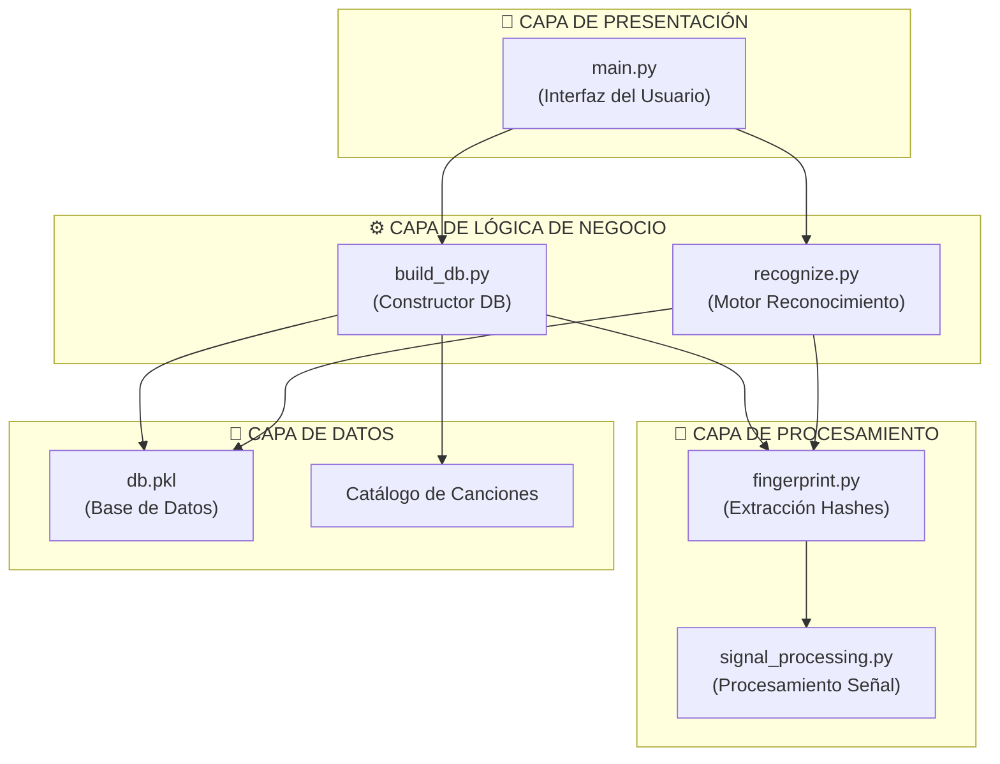
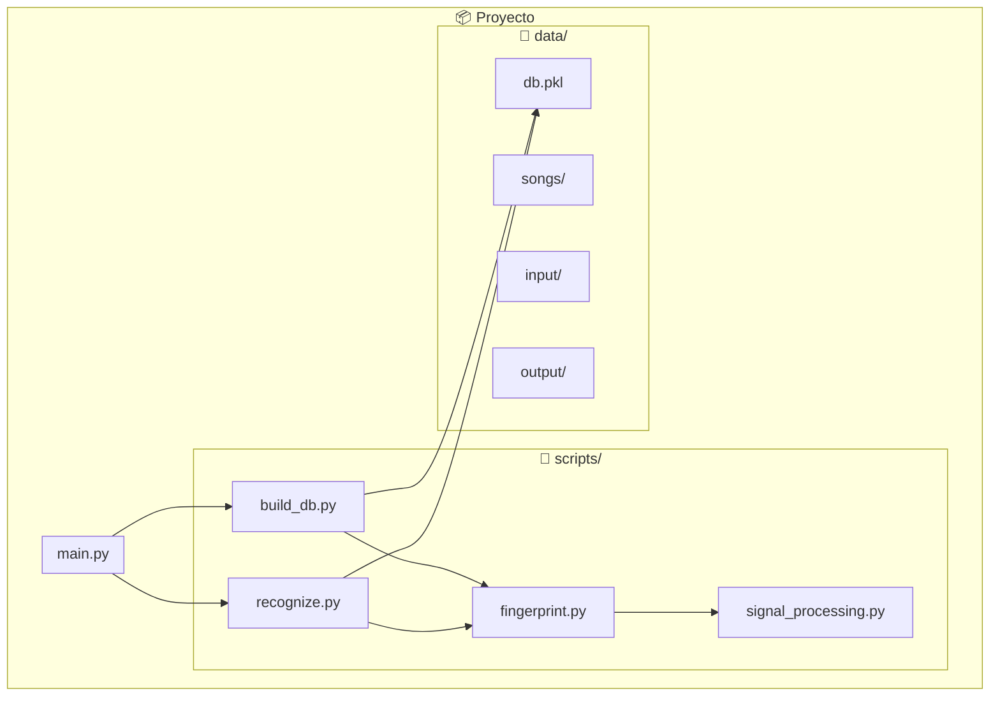
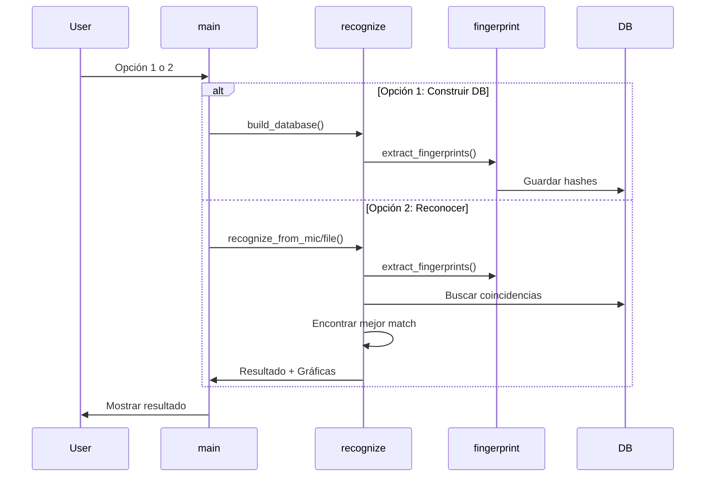

# Matematicas-especiales
En este repositorio estará todo el desarrollo y documentación relacionados con el proyecto final de la materia de matemáticas especiales.

## Descripción del Proyecto
Sistema de reconocimiento de canciones tipo **Shazam** que utiliza técnicas de procesamiento de señales y análisis espectral para identificar canciones a partir de audio en vivo o archivos. El sistema utiliza **fingerprinting perceptual** basado en picos espectrales y hashes relativos.

# Configuración del proyecto
La primera vez que se quiera ejecutar el proyecto por primera vez use este comando para dejar todas las librerias configuradas
```Bash
pip install -r requirements.txt
```

---

## Arquitectura del Proyecto

### Diagrama de Arquitectura



### Diagrama de Paquetes



### Descripción de Módulos

| Módulo | Función |
|--------|---------|
| **main.py** | Menú interactivo principal. Gestiona las opciones del usuario |
| **build_db.py** | Construye/actualiza la base de datos a partir de las canciones del catálogo |
| **fingerprint.py** | Extrae fingerprints (hashes perceptuales) del audio usando STFT y análisis de picos espectrales |
| **signal_processing.py** | Carga audio, aplica filtros, limpieza, genera espectrogramas y gráficas |
| **recognize.py** | Motor de reconocimiento. Compara fingerprints, calcula offsets y genera visualizaciones |
| **view_db.py** | Utilidad para inspeccionar la base de datos |

---

## Flujo de Ejecución

### Diagrama de Secuencia Simplificado



---

## Procesamiento de Señal: Resumen

**Pasos clave:**

1. **Cargar Audio** → Convertir a mono, normalizar
2. **STFT** → Transformar a dominio tiempo-frecuencia (n_fft=4096)
3. **Detectar Picos** → Encontrar picos espectrales prominentes
4. **Generar Hashes** → Crear hashes relativos entre pares de picos
5. **Matching** → Comparar fingerprints, calcular desfase temporal
6. **Resultado** → Identificar canción y mostrar gráficas

---

## Visualizaciones Generadas

El sistema genera automáticamente las siguientes gráficas durante el reconocimiento:

1. **Espectrograma Original** (`entrada_audio_*_spectrograma_*.png`)
   - Muestra toda la señal de audio en el dominio tiempo-frecuencia
   - Usada para análisis visual del contenido espectral

2. **Espectrograma con Match Resaltado** (`match_*_spectrograma_completo_match_*.png`)
   - Espectrograma con rectángulo rojo indicando la región donde se encontró la coincidencia
   - Permite verificar visualmente la precisión del matching

3. **Histograma de Desfases** (`match_*_histograma_desfases_*.png`)
   - Gráfica de barras mostrando la distribución de desfases temporales encontrados
   - El pico más alto corresponde al desfase correcto
   - Visualiza la confianza del match

---

## Tecnologías Utilizadas

- **librosa**: Carga y procesamiento de audio (MP3, WAV, etc.)
- **scipy.signal**: STFT, detección de picos, filtros digitales
- **numpy**: Operaciones numéricas y álgebra lineal
- **matplotlib**: Generación de gráficas y espectrogramas
- **PyAudio**: Captura de audio en tiempo real
- **pickle**: Serialización de la base de datos de fingerprints
